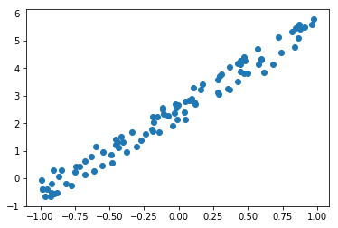
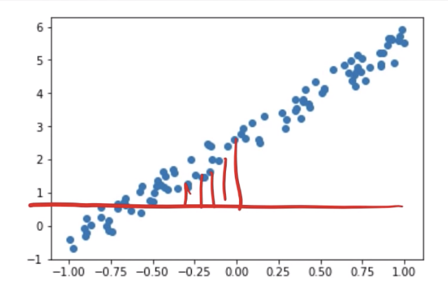
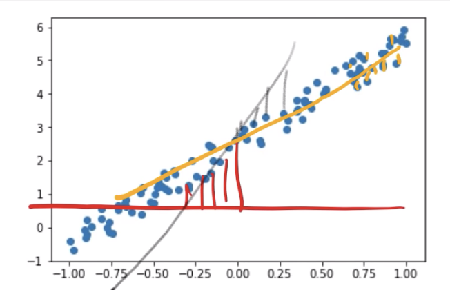
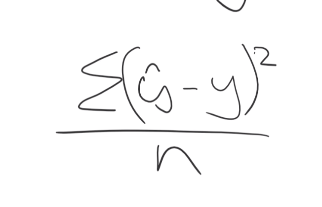

# fast-ai-notebook
Fastai + GCP + Pipenv

1. Pipenv configs
```
pipenv shell

pipenv install 
```

2. Open notebook
```
cd nbs
su # enter your UNIX password. Otherwise you are not going to be able to save files on jupyter
jupyter notebook --ip=0.0.0.0 --port=8888 --no-browser --allow-root
```

3. Access notebook at [http://your-external-ip:8888/tree](http://your-external-ip:8888/tree)

## Warning
This is only for your fastai course. NOT for something you might wanna try out privately. This may be **insecure**.

# Notes
## Lesson 2

### Generating dummy data 

Generate data.

```python
a = tensor(3.,2); 
```

means a1 = 3 and a2 = 2

```python
x@a 
```

means a matrix product between x and a.

```
tensor
```

what is this? what's tensor? It means an **array of a regular shape.** Any array that has a rectangular shape where every column and every row... basically where every axis has the same length for all other axes.

We all have this all the time.

Image is a 3D tensor. It's got:
1. Num of channels
2. Num of rows
3. Num of cols 

You say the image is a **rank 3** tensor. 

Then what's `tensor(3.,2)`? Rank 1 tensor, also known as a **vector**. 

In short, tensors are just arrays. 

`tensor(3.,2)` represents:
1. the slope = 3 (a1)
2. the intercept = 2 (a2)
in `y = a1x1 + a2x2` (Where x2 stays at 1 all the time)

```python
x = torch.ones(n,2)
```

You are telling pythorch you are trying to create a tensor n by 2. You get **a rank 2** tensor. #rows = N. #cols = 2. 

If n = 100,
x would be:
```python
tensor([[1., 1.],
        [1., 1.],
        [1., 1.],
        [1., 1.],
    ... (100 times in total)
        [1., 1.],
        [1., 1.],
        [1., 1.],
        [1., 1.]])
```

`torch.ones` means that everything inside that tensor will be filled with 1.

```python
x[:,0]
```
this means 'on every single row at column 0', 
so, easily said:

the whole left part of what you saw above. bunch of 1's. 

and 

```python
uniform_
```

means uniform random number. In pytorch `_` means don't return anything, but replace whatever this is being called on with the result of this function. 

So it will replace the value of column 0's with the random numbers!

So finally if you look at the first five rows:

```
x[:5] == tensor([[-0.3074,  1.0000],
        [ 0.5002,  1.0000],
        [ 0.9761,  1.0000],
        [ 0.2937,  1.0000],
        [ 0.0507,  1.0000]])
```

```python
y = x@a + torch.rand(n)
```
This line will run a matrix product between x and a, and add some noise to it by using random numbers. 

Now you are not really interested in x2, because they are all 1's. They are just there. 

So you are going to just plot the zero-indexed column against the y:

```
plt.scatter(x[:,0], y)
```

So this is a dummy data represetning something like temperature and icecream sales. 

Now we are going to pretend we never knew the coefficients of 3 and 2 we just put in. 

How and why is it even important?

### Looking for the coefficients

If we can find those coefficients, we can also **fit arbitrary functions that convert from pixel values to probabilities.** 



So we want to what pytorch calls **parameters** (in statistics, coefficients) such that the line it creates minimizes the error between the line and the points. 

The process of looking for the righg parameters is intuitive:
1. You just put in different a1 and a2s and measure the difference between points and the line drown with a1 and a2. 
2. Eventually we come up with some line that kind of gets close with the points around it. 





Well certainly there is an equation for this:
1. Get how far away the line is at each spot away from the points 
2. Take average of all those (which is called **loss**)
3. Minimize the loss. That's the answer. This is called **mean squared error, MSE.**. 

This is called a regression problem the dependent variable (y) is continuous (not discrete)

MSE takes 2 params:

```python
def mse(y_hat, y):
    return ((y_hat-y)**2).mean()
```

- y_hat is usually the prediction you make
- y is the actual data

The value of MSE is just the difference between those two squared, and the value taken for a mean. 

This function is equal to:



So this is a **loss function**. This tells us **how good our line is.**

So let's test this out. 

say, a were `tensor(-1.,1)`. (if you put `.` for the first number, python knows you want to do it for the second as well, so it automatically does.)

```python
y_hat = x@a
```

calculate our prediction with a matrix product. 

And there's our loss. 

**Then how do we make it a little bit better?** There are only 2 numbers. You are going to use gradient descent. What if you made thre gradient a bit more positive/negative? And then does that make the loss better or not? 

The cool thing is that you don't have to move it around and flip it back and forth. You can calculate the derivative. It tells you how changing a1 up or down would change MSE more quickly than just moving it up and down manually. 

How do we calculate derivatives? call `a.grad`. 
So what you are gonna do is to run some loops to update the gradient. You calculate the gradient by using `loss.backward()`. 

What happens to this derivative (gradient)? They go into the attribute called `a.grad`. You are going to take coefficient `a` and subtract from it the gradient `grad`. There's an underscore, meaning 'in place'. 

Why do we subtract? Gradient tells us if we move the whole thing down, the loss goes up and the opposite happens for the opposite. We want our loss to be small. 

lr? learning rate. Literally, it's just a thing we multiply with the `a.grad`. Why do we need this? 

Example:


